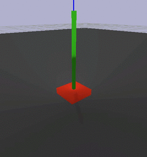
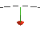

# cartpole ++

cartpole++ is a non trivial 3d version of cartpole 
simulated using [bullet physics](http://bulletphysics.org/) where the pole _isn't_ connected to the cart.



this repo contains a [gym env](https://gym.openai.com/) for this cartpole as well as implementations for training with ...

* likelihood ratio policy gradients ( [lrpg_cartpole.py](lrpg_cartpole.py) ) for the discrete control version
* [deep deterministic policy gradients](http://arxiv.org/abs/1509.02971) ( [ddpg_cartpole.py](ddpg_cartpole.py) ) for the continuous control version
* [normalised advantage functions](https://arxiv.org/abs/1603.00748) ( [naf_cartpole.py](naf_cartpole.py) ) also for the continuous control version

we also train a [deep q network](https://www.cs.toronto.edu/~vmnih/docs/dqn.pdf) from [keras-rl](https://github.com/matthiasplappert/keras-rl) as an externally implemented baseline.

for more info see [the blog post](http://matpalm.com/blog/cartpole_plus_plus/). 
for experiments more related to potential transfer between sim and real see [drivebot](https://github.com/matpalm/drivebot).
for next gen experiments in continuous control from pixels in minecraft see [malmomo](https://github.com/matpalm/malmomo)

## general environment

episodes are initialised with the pole standing upright and receiving a small push in a random direction

episodes are terminated when either the pole further than a set angle from vertical or 200 steps have passed

there are two state representations available; a low dimensional one based on the cart & pole pose and a high dimensional one based on raw pixels (see below)

there are two options for controlling the cart; a discrete and continuous method (see below)

reward is simply 1.0 for each step in the episode

### states

in both low and high dimensional representations we use the idea of action repeats; 
per env.step we apply the chosen action N times, take a state snapshot and repeat this R times. 
the deltas between these snapshots provides enough information
to infer velocity (or acceleration (or jerk)) if the learning algorithm finds that useful to do.

observation state in the low dimensional case is constructed from the poses of the cart & pole
* it's shaped `(R, 2, 7)`
* axis 0 represents the R repeats
* axis 1 represents the object; 0=cart, 1=pole
* axis 2 is the 7d pose; 3d postition + 4d quaternion orientation
* this representation is usually just flattened to (R*14,) when used

the high dimensional state is a rendering of the scene 
* it's shaped `(height, width, 3, R, C)`
* axis 0 & 1 are the rendering height/width in pixels
* axis 2 represents the 3 colour channels; red, green and blue
* axis 3 represents the R repeats
* axis 4 represents which camera the image is from; we have the option of rendering with one camera or two (located at right angles to each other)
* this representation is flattened to have shape `(H, W, 3*R*C)`. we do this for ease of use of conv2d operations. (TODO: try conv3d instead)



### actions

in the discrete case the actions are push cart left, right, up, down or do nothing.

in the continuous case the action is a 2d value representing the push force in x and y direction (-1 to 1)

### rewards 

in all cases we give a reward of 1 for each step and terminate the episode when either 200 steps have passed or 
the pole has fallen too far from the z-axis

## agents

### random agent

we use a random action agent (click through for video) to sanity check the setup.
add `--gui` to any of these to get a rendering

[](https://www.youtube.com/watch?v=buSAT-3Q8Zs)

```
# no initial push and taking no action (action=0) results in episode timeout of 200 steps.
# this is a check of the stability of the pole under no forces
$ ./random_action_agent.py --initial-force=0 --actions="0" --num-eval=100 | ./deciles.py 
[ 200.  200.  200.  200.  200.  200.  200.  200.  200.  200.  200.]

# no initial push and random actions knocks pole over
$ ./random_action_agent.py --initial-force=0 --actions="0,1,2,3,4" --num-eval=100 | ./deciles.py
[ 16.   22.9  26.   28.   31.6  35.   37.4  42.3  48.4  56.1  79. ]

# initial push and no action knocks pole over
$ ./random_action_agent.py --initial-force=55 --actions="0" --num-eval=100 | ./deciles.py
[  6.    7.    7.    8.    8.6   9.   11.   12.3  15.   21.   39. ]

# initial push and random action knocks pole over
$ ./random_action_agent.py --initial-force=55 --actions="0,1,2,3,4" --num-eval=100 | ./deciles.py 
[  3.    5.9   7.    7.7   8.    9.   10.   11.   13.   15.   32. ]
```

### discrete control with a deep q network

```
$ ./dqn_cartpole.py \
 --num-train=2000000 --num-eval=0 \
 --save-file=ckpt.h5
```

result by numbers...

```
$ ./dqn_cartpole.py \
 --load-file=ckpt.h5 \
 --num-train=0 --num-eval=100 \
 | grep ^Episode | sed -es/.*steps:// | ./deciles.py 
[   5.    35.5   49.8   63.4   79.   104.5  122.   162.6  184.   200.   200. ]
```

result visually (click through for video)

[](https://www.youtube.com/watch?v=zteyMIvhn1U)

```
$ ./dqn_cartpole.py \
 --gui --delay=0.005 \
 --load-file=run11_50.weights.2.h5 \
 --num-train=0 --num-eval=100
```

### discrete control with likelihood ratio policy gradient

policy gradient nails it

```
$ ./lrpg_cartpole.py --rollouts-per-batch=20 --num-train-batches=100 \
 --ckpt-dir=ckpts/foo
```

result by numbers...

```
# deciles
[  13.    70.6  195.8  200.   200.   200.   200.   200.   200.   200.   200. ]
```

result visually (click through for video)

[](https://www.youtube.com/watch?v=aricda9gs2I)

### continuous control with deep deterministic policy gradient

```
./ddpg_cartpole.py \
 --actor-hidden-layers="100,100,50" --critic-hidden-layers="100,100,50" \
 --action-force=100 --action-noise-sigma=0.1 --batch-size=256 \
 --max-num-actions=1000000 --ckpt-dir=ckpts/run43
```

result by numbers

```
# episode len deciles
[  30.    48.    56.8   65.    73.    86.   116.4  153.3  200.   200.   200. ]
# reward deciles
[  35.51154724  153.20243076  178.7908135   243.38630372  272.64655323
  426.95298195  519.25360223  856.9702368   890.72279221  913.21068417
  955.50168709]
```

result visually (click through for video)

[](https://www.youtube.com/watch?v=8X05GA5ZKvQ)

### low dimensional continuous control with normalised advantage functions

```
./naf_cartpole.py --action-force=100 \
--action-repeats=3 --steps-per-repeat=4 \
--optimiser=Momentum --optimiser-args='{"learning_rate": 0.0001, "momentum": 0.9}' \
```

similiar convergence to ddpg

### high dimensional continuous control with normalised advantage functions

does OK, but not perfect yet. as a human it's hard to do even... (see [the blog post](http://matpalm.com/blog/cartpole_plus_plus/))

## general utils

run a random agent, logging events to disk (outputs total rewards per episode)

note: for replay logging will need to compile protobuffer `protoc event.proto --python_out=.`

```
$ ./random_action_agent.py --event-log=test.log --num-eval=10 --action-type=continuous
12
14
...
```

review event.log (either from ddpg training or from random agent)

```
$ ./event_log.py --log-file=test.log --echo
event {
  state {
    cart_pose: 0.116232253611
    cart_pose: 0.0877446383238
    cart_pose: 0.0748709067702
    cart_pose: 1.14359036161e-05
    cart_pose: 5.10180834681e-05
    cart_pose: 0.0653914809227
    cart_pose: 0.997859716415
    pole_pose: 0.000139251351357
    pole_pose: -0.0611916743219
    pole_pose: 0.344804286957
    pole_pose: -0.123383037746
    pole_pose: 0.00611496530473
    pole_pose: 0.0471726879478
    pole_pose: 0.991218447685
    render {
      height: 120
      width: 160
      rgba: "\211PNG\r\n\032\n\000\..."
    }
  }
  is_terminal: false
  action: -0.157108291984
  action: 0.330988258123
  reward: 4.0238070488
}
...
```

generate images from event.log

```
$ ./event_log.py --log-file=test.log --img-output-dir=eg_renders
$ find eg_renders -type f | sort
eg_renders/e_00000/s_00000.png
eg_renders/e_00000/s_00001.png
...
eg_renders/e_00009/s_00018.png
eg_renders/e_00009/s_00019.png
```

1000 events in an event_log is roughly 750K for the high dim case and 100K for low dim
