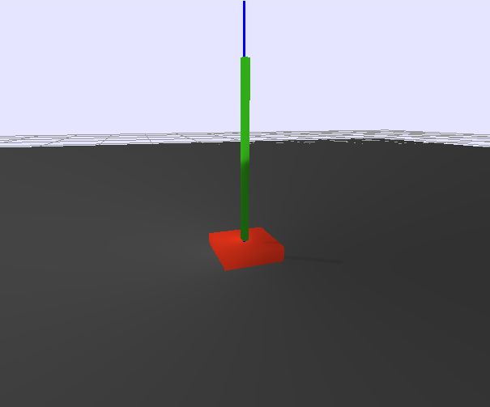

# cartpole ++

cartpole++ is a non trivial 3d version of cartpole 
simulated using [bullet physics](http://bulletphysics.org/) where the pole isn't connected to the cart.



this repo contains a [gym env](https://gym.openai.com/) for this cartpole as well as example policies trained with ...

* a [deep q network](https://www.cs.toronto.edu/~vmnih/docs/dqn.pdf) from [keras-rl](https://github.com/matthiasplappert/keras-rl)
* a likelihood ratio policy gradient method (lrpg_cartpole.py) for the discrete control version
* a [deep deterministic policy gradient method](http://arxiv.org/abs/1509.02971) (ddpg_cartpole.py) for the continuous control version

observation state is 28d tuple
* 7d pose of cart (3d position + 4d quaternion orientation)
* 7d pose of pole (also included since pole isn't connected to cart)
* 7d pose of cart last time step
* 7d pose of pole last time step

see [the blog post](http://matpalm.com/blog/cartpole_plus_plus/) for more info...

```
# some random things i did...
sudo apt-get install libhdf5-dev
virtualenv venv --system-site-packages
. venv/bin/activate
pip install keras numpy h5py 
pip install <whatever_tensorflow_wheel_file>
export PYTHONPATH=$PYTHONPATH:$HOME/dev/keras-rl

# for replay logging will need to compile protobuffer
protoc event.proto --python_path=.
```

## discrete version

* 5 actions; go left, right, up, down, do nothing
* +1 reward for each step pole is up.

### random agent

example behaviour of random action agent (click through for video)

[](https://www.youtube.com/watch?v=buSAT-3Q8Zs)

```
# some sanity checks...

# no initial push and taking no action (action=0) results in episode timeout of 200 steps
$ ./random_action_agent.py --initial-force=0 --actions="0" --num-eval=100 | ./deciles.py 
[ 200.  200.  200.  200.  200.  200.  200.  200.  200.  200.  200.]

# no initial push and random actions knocks pole over
$ ./random_action_agent.py --initial-force=0 --actions="0,1,2,3,4" --num-eval=100 | ./deciles.py
[ 16.   22.9  26.   28.   31.6  35.   37.4  42.3  48.4  56.1  79. ]

# initial push and no action knocks pole over
$ ./random_action_agent.py --initial-force=55 --actions="0" --num-eval=100 | ./deciles.py
[  6.    7.    7.    8.    8.6   9.   11.   12.3  15.   21.   39. ]

# initial push and random action knocks pole over
$ ./random_action_agent.py --initial-force=55 --actions="0,1,2,3,4" --num-eval=100 | ./deciles.py 
[  3.    5.9   7.    7.7   8.    9.   10.   11.   13.   15.   32. ]
```

### training a dqn

```
$ ./dqn_bullet_cartpole.py \
 --num-train=2000000 --num-eval=0 \
 --save-file=ckpt.h5
```

result by numbers...

```
$ ./dqn_bullet_cartpole.py \
 --load-file=ckpt.h5 \
 --num-train=0 --num-eval=100 \
 | grep ^Episode | sed -es/.*steps:// | ./deciles.py 
[   5.    35.5   49.8   63.4   79.   104.5  122.   162.6  184.   200.   200. ]
```

result visually (click through for video)

[](https://www.youtube.com/watch?v=zteyMIvhn1U)

```
$ ./dqn_bullet_cartpole.py \
 --gui --delay=0.005 \
 --load-file=run11_50.weights.2.h5 \
 --num-train=0 --num-eval=100
```

### training using likelihood ratio policy gradient

policy gradient nails it; though this is after >12hrs training :/

```
$ ./lrpg_cartpole.py --rollouts-per-batch=20 --num-train-batches=100 \
 --ckpt-dir=ckpts/foo
```

result by numbers...

```
# deciles
[  13.    70.6  195.8  200.   200.   200.   200.   200.   200.   200.   200. ]
```

result visually (click through for video)

[](https://www.youtube.com/watch?v=aricda9gs2I)

## continuous version

* 2d action; force to apply on cart in x & y directions
* +1 base reward for each step pole is up. up to an additional +4 as force applied tends to 0.

### training using deep deterministic policy gradient

```
./ddpg_cartpole.py \
 --actor-hidden-layers="100,100,50" --critic-hidden-layers="100,100,50" \
 --action-force=100 --action-noise-sigma=0.1 --batch-size=256 \
 --max-num-actions=1000000 --ckpt-dir=ckpts/run43
```

result by numbers

```
# episode len deciles
[  28.    45.8   55.8   62.    68.2   78.    94.4  116.6  155.2  200.   200. ]
# reward deciles
[  69.38985073  141.13007933  169.3078872   201.67747291  236.90857766
  280.20549274  341.64294321  430.14951458  642.42594679  877.00156479
  935.87118159]
```

result visually (click through for video)

[](https://www.youtube.com/watch?v=WFQ4r4_xZI0)
